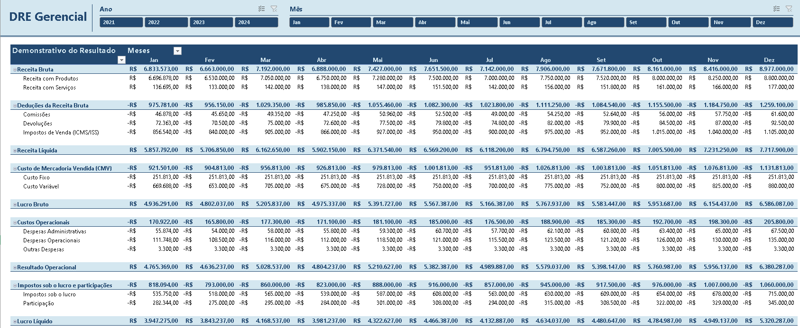

# 💰 DRE Gerencial Dinâmica em Excel (2021-2024)

 
## 📌 Sobre o Projeto
Este projeto demonstra a construção de uma **Demonstração do Resultado do Exercício (DRE) Gerencial** interativa, cobrindo uma série histórica de **4 anos (2021 a 2024)**.

Os dados são **100% simulados** para fins de portfólio. O objetivo principal foi transformar uma **base de dados transacional bruta** em um relatório financeiro padronizado, permitindo análises rápidas sobre a saúde econômica do negócio.

O relatório final permite a identificação imediata de margens (Bruta, Operacional e Líquida) e a comparação de desempenho mês a mês e ano a ano.

---

## 🛠️ Ferramentas e Técnicas Dominadas
- **Microsoft Excel** (Modelagem de Dados)
- **Tabelas Dinâmicas** (Agregação de 4 Anos de Dados)
- **Cálculos Avançados em Tabela Dinâmica:** Utilização de **Item Calculado** para inserir as linhas de totalização gerenciais (`Receita Líquida`, `Lucro Bruto`, `Lucro Líquido`, etc.).
- **Lógica Contábil de Sinais:** Implementação da **técnica de adição (+)** para subtrair despesas, custos e impostos formatados como valores negativos (`-R$`).
- **Segmentação de Dados (Slicer):** Filtro dinâmico por `Ano` e `Mês` para análise de tendência e sazonalidade.

---

## 📂 Estrutura do Repositório
- `DRE_Gerencial_2021_2024.xlsx` → Arquivo principal do relatório.
- `README.md` → Documentação do projeto.
- `csv_dre_gerencial.txt` → Arquivo de texto contendo a base de dados em formato CSV para importação.
- `Preview_DRE_Gerencial.png` → Imagem de pré-visualização do relatório final.

---

## 📑 Preparação e Modelagem da Base de Dados

### 1. Organização da Pasta de Trabalho
A pasta de trabalho está organizada da seguinte forma, focando na experiência do usuário:

| Aba Exibida | Finalidade |
| :--- | :--- |
| **DRE_Gerencial** | Relatório final e interface de interação com filtros. |
| **Base de Dados** | Planilha-mestra contendo todos os registros de 2021 a 2024. |
| **CSV** | (Aba Oculta) Contém a base de dados importada em formato CSV. |
| **Paleta de Cores** | (Aba Oculta) Contém as referências de cores utilizadas no design. |

### 2. Estrutura da DRE (Tabela Dinâmica)
O relatório final foi construído sobre uma única Tabela Dinâmica, utilizando uma técnica avançada de filtragem para desmembrar os anos e meses de forma independente:

- **Colunas:** Apenas o campo **Mês** (`Jan` a `Dez`). Essa configuração permite que os resultados de todos os anos sejam mostrados lado a lado se nenhum filtro estiver aplicado.
- **Linhas:** **Categoria da Conta** e **Conta** (mantém a hierarquia contábil do DRE).
- **Valores:** **Demonstrativo do Resultado** (Soma do campo `Valor` e Item Calculado).

- **Filtros Dinâmicos (Slicers):** A interatividade é fornecida por dois Slicers externos, ambos conectados à Tabela Dinâmica. Essa separação permite análises flexíveis:
    - **Slicer de Ano:** O campo `Ano` está conectado à Tabela Dinâmica como filtro primário, permitindo isolar o desempenho de um exercício específico (2021, 2022, 2023, ou 2024).
    - **Slicer de Mês:** O campo `Mês` é usado como Slicer secundário. **Quando o Slicer de Ano é aplicado, a Tabela Dinâmica mostra apenas os 12 meses do ano selecionado.**

---

## 📊 Cálculos Gerenciais Essenciais

As linhas de totalização foram inseridas via **Item Calculado** dentro da Tabela Dinâmica, garantindo a rastreabilidade e a precisão do resultado:

1.  **Receita Líquida:** `Receita Bruta + Deduções da Receita Bruta`
2.  **Lucro Bruto:** `Receita Líquida + Custo de Mercadoria Vendida (CMV)`
3.  **Resultado Operacional:** `Lucro Bruto + Custos Operacionais`
4.  **Lucro Líquido:** `Resultado Operacional + Impostos sobre o Lucro e Participações`

*A utilização da adição (+) foi possível e correta, pois os custos, despesas e impostos foram previamente formatados como valores negativos na base de dados.*

---

## 🚀 Como Usar
1. Baixe o arquivo `DRE_Gerencial_2021_2024.xlsx` e abra-o no Excel.
2. Use os **Slicers de Ano e Mês** na aba `DRE_Gerencial` para filtrar os resultados.
3. Analise a evolução do Lucro Líquido, Margem Bruta e Resultado Operacional ao longo dos 4 anos.

---

## 📌 Observações
- Todos os dados são **simulados** para fins de portfólio.

---
